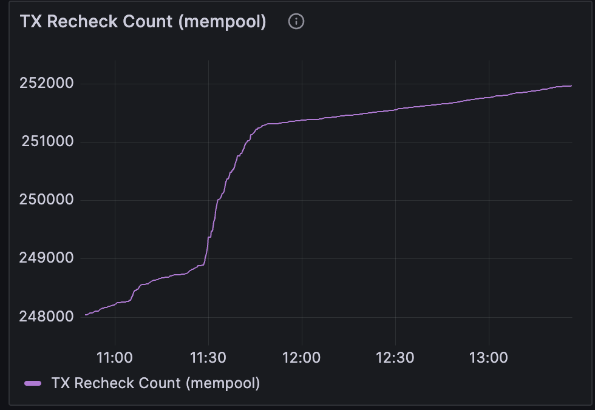
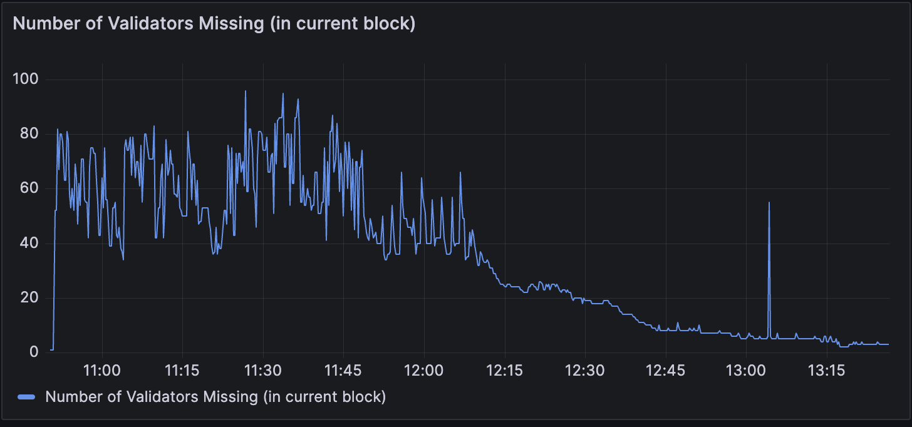
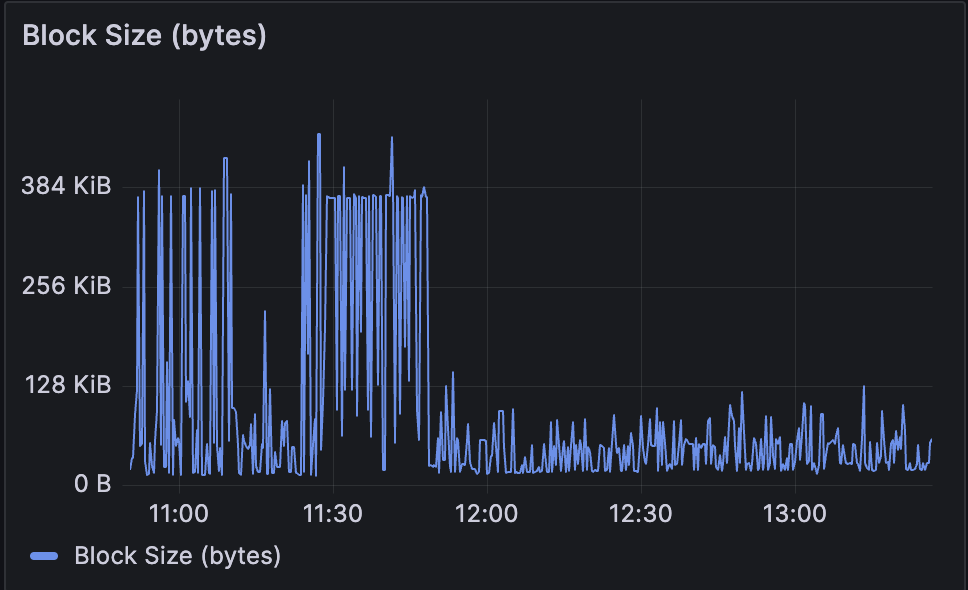
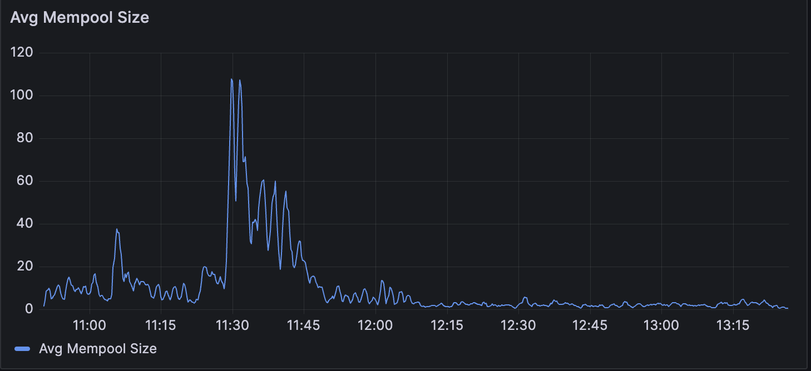
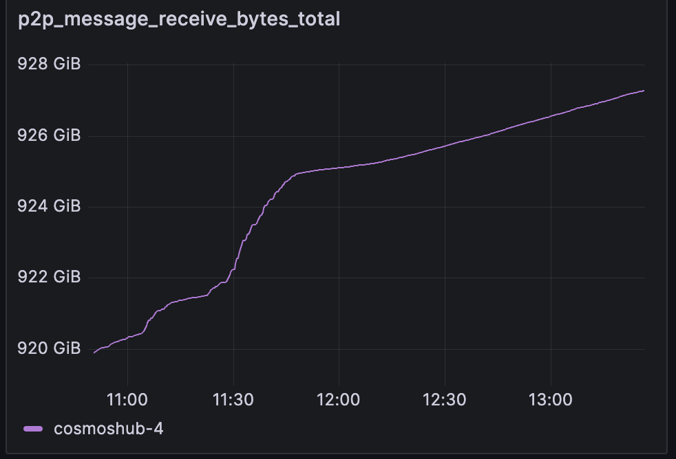
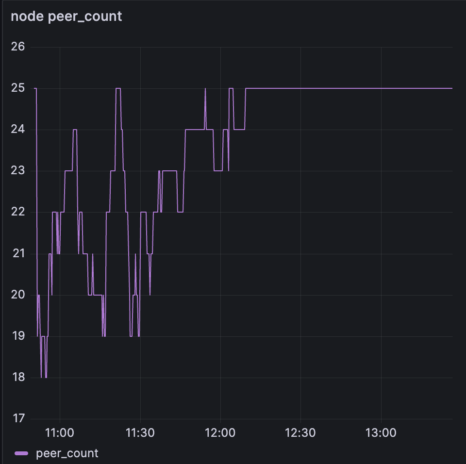
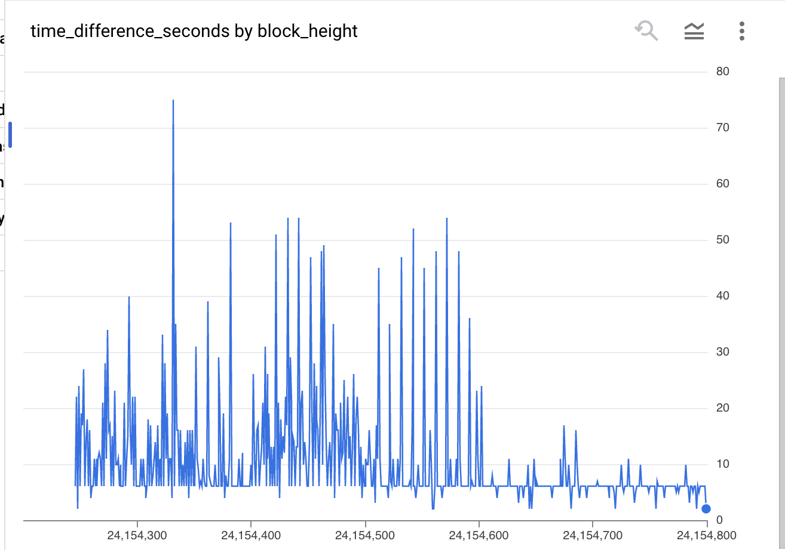
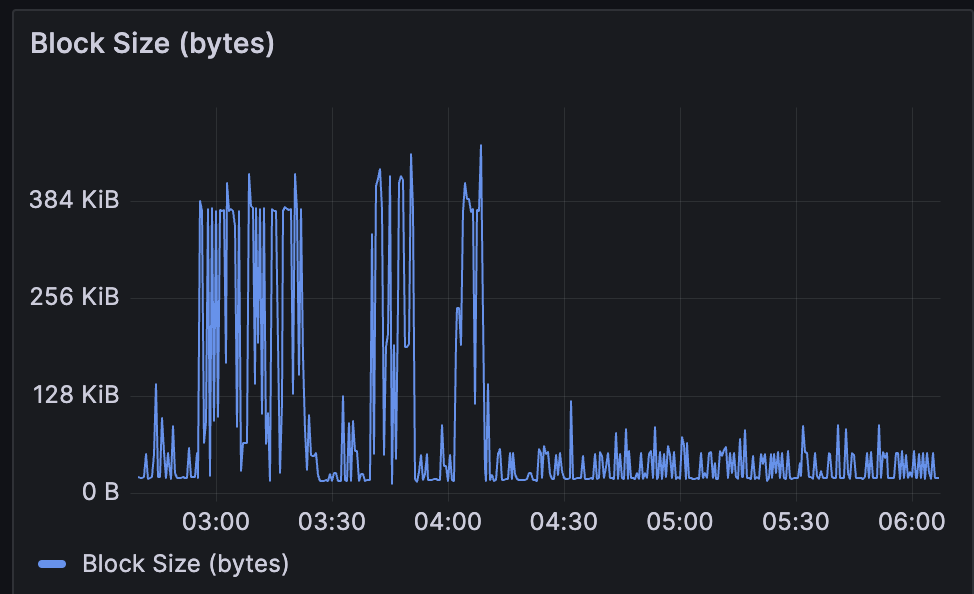
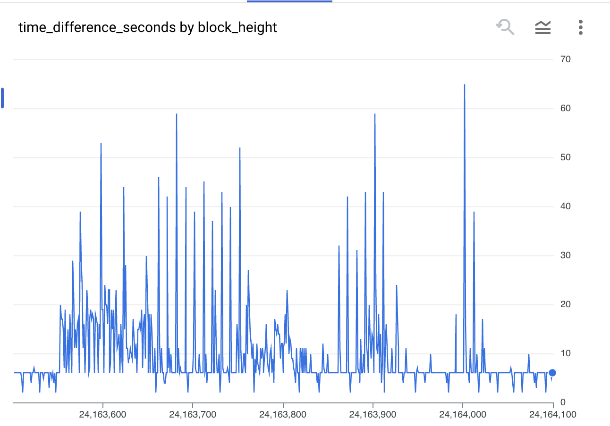

# Cosmos Hub incident - 2025/01/27

## What happened?

Large multisends on the Hub caused an increase in block times, a decrease in validator uptime, a drop in connected peers.

At Jan 27th 2025, 18:50:28 UTC, block [24154245](https://www.mintscan.io/cosmos/block/24154245), multisend txns with 3000+ sends each 
([1](https://www.mintscan.io/cosmos/tx/61C0A837F46D8957A50FDABF1DA5DDB5F171EB4BBD3B8F4F425A0EC3443F9A26?height=24154245), [2](https://www.mintscan.io/cosmos/tx/16AB8C00D910E5EECBDB29C130D1A665B5F3AE643E79202C7D0706ED2827A28F?height=24154245)) 
were included in the block. The first of these transactions landing on chain coincided with a drop in validators included in the block and a drop in connected peers. 
The final set of multisends was included in a block at Jan 27th 2025, 19:47:42 UTC block [24154492](https://www.mintscan.io/cosmos/block/24154492). 
Recovery for block time happened rapidly once them multisends were no longer being included in the blocks. Validator uptime increase happened more gradually over time.

A second set of multisends began at Jan 28th 2025, 10:55:08 UTC and lasted just over an hour. The effects of spam were very similar between the two time periods.

## Metrics during event 1 [^1] [^2]:















## Metrics during event 2





[^1]: https://monitor.polypore.xyz/d/UJyurCTWz/cosmos-dashboard?from=1738004122000&to=1738013200000&orgId=2
[^2]: https://insights.informal.systems/cosmoshub/network-metrics

## Root cause

Without more detailed information, it’s hard to give an exact root cause. The transactions were large, but not so large that it should have had this large of an impact. Specifically, it would be helpful to have more info on:

- Cause of peer disconnects
- Cause of Recheck tx failures
- Size of txs in the mempool

Our best guess at this point is that the spammer sent many multisends, all of which ended up in the mempool, but only 2 of which ended up in each block.
The others were not included in block N+1 due to increased gas prices. The large amount of duplicated txn gossip then caused p2p issues like peer disconnects which affected uptime for a large portion of validators.

**Why doesn’t the feemarket prevent issues like this?**

The feemarket adjusts fees based on network congestion in terms of gas. The current state of feemarket params on the Hub are:

```go
// The maximum amount of gas allowed to be used per block
// The target amount of utilization is MaxBlockUtilization/2
MaxBlockUtilization = 75_000_000
// The number of historical blocks to consider when adjusting the min gas price
Window = 1
```

Given that the max gas provided for the multisends was 70_000_000 and the actual utilization was around 50_000_000, the multisend blocks should have caused gas prices to increase. 
However, the window being size 1 means it would immediately start adjusting downwards in the following block.

Note the gas prices starting on the first block of tx inclusion, and how the price per gas is adjusted back to baseline after 1 block: 

| Block | Price Per Gas (uatom) |
| --- | --- |
| 24154245 | 0.005274423700000000 |
| 24154246 | 0.005000000000000000 |
| 24154247 | 0.005229676233333333 |
| 24154248 | 0.005000000000000000 |
| 24154249 | 0.005229726816666667 |
| 24154250 | 0.005000000000000000 |
| 24154251 | 0.005231696383333333 |
| 24154252 | 0.005000000000000000 |

## Action items

- As a temporary stopgap, ICL suggests adjustment to the feemarket params.
- Enable additional telemetry for rechecked transaction failures and peer disconnects
- Gain additional visibility into the status of the live Hub network (validator profiles, metrics, logs)
- Create appropriate load tests mimicking the incident (i.e. multisend load)

## Potential learnings

- How fast can the gas usage increase while not falling over?
- Transactions with lower gas fees will sit in the mempool until the fees go down
    - Because the fees were reducing after 1 block, there ended up being a 1 block delay on inclusion

## Timeline

| Time (UTC) | Event |
| --- | --- |
| Jan 27th 2025, 18:50:28 UTC (block [24154245](https://www.mintscan.io/cosmos/block/24154245)) | Multisends 1 Begin—Immediate Impact |
| Jan 27th 2025, 19:47:42 UTC (block [24154492](https://www.mintscan.io/cosmos/block/24154492)) | Multisends 1 End |
| Jan 28th 2025, 10:55:08 UTC (block [24163551](https://www.mintscan.io/cosmos/block/24163551)) | Multisends 2 Begin |
| Jan 28th 2025, 12:08:51 UTC (block [24163916](https://www.mintscan.io/cosmos/block/24163916)) | Multisends 2 End |

## Acknowledgements

- Hypha + Informal - for supporting us through the incident and post-incident with data
- Jacob Gadikian (@gadikian) - for reporting the P2P and bank storms issues to our HackerOne bug bounty program
